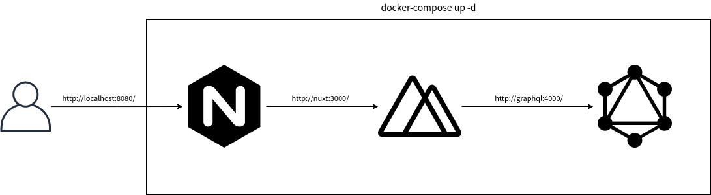

Benchmarking Nginx Stale-caching with Nuxt-Graphql stack
======================================================



# Setup

```bash
$ cd docker
$ docker-compose up -d
$ sudo apt-get install apache2-utils
```

# Benchmarks

## Environment
- Ubuntu 18.04
- AMD Ryzen 3300X
- nginx.conf optimized for load testing

## Case: without caching
```bash
$ ab -c 100 -t 30 -k http://localhost:8080/
```

#### Result
```text
Requests per second:    576.09 [#/sec] (mean)
Time per request:       173.584 [ms] (mean)
Time per request:       1.736 [ms] (mean, across all concurrent requests)
Transfer rate:          1991.56 [Kbytes/sec] received

Connection Times (ms)
              min  mean[+/-sd] median   max
Connect:        0    0   0.2      0       3
Processing:    76  173  22.3    167     459
Waiting:       76  173  22.3    167     459
Total:         79  173  22.4    167     461
```


## Case: with caching on Nuxt

#### Setup
1. Find ```docker/nginx/default.conf``` and unquote lines from 30~35
2. Execute following command

```bash
$ cd docker
$ docker exec -it stale_cache_nginx sh
$ nginx -s reload
```

###### Whether caching is in action?

Open browser, and navigate to ```http://localhost:8080/```  
Open browser's **devtool** (By press F12), go to **Network** tab

Then, refresh the page, check **request's headers**,
if there's "**X-Cache-Status**" header in them, and possibly its value is **STALE** OR **HIT**,
this means caching is working.

#### Result
```
Requests per second:    93875.03 [#/sec] (mean)
Time per request:       1.065 [ms] (mean)
Time per request:       0.011 [ms] (mean, across all concurrent requests)
Transfer rate:          326551.24 [Kbytes/sec] received

Connection Times (ms)
              min  mean[+/-sd] median   max
Connect:        0    0   0.2      0       6
Processing:     0    1   1.2      0      11
Waiting:        0    1   1.2      0      11
Total:          0    1   1.2      0      11
```

# More treasure in nginx caching behavior

#### Nuxt build fails
Check this [episode](https://www.nginx.com/blog/nginx-caching-guide/#stale)

# References
- [The Benefits of Microcaching with NGINX](https://www.nginx.com/blog/benefits-of-microcaching-nginx/)
- [A Guide to Caching with NGINX and NGINX Plus](https://www.nginx.com/blog/nginx-caching-guide/)
- [Ubuntu Linux 用 ab 指令測試網站效能](https://www.arthurtoday.com/2015/03/Using-ab-command-to-test-web-page-loading-time-in-ubuntu-linux.html)
- [github/.gitignore](https://github.com/github/gitignore)
- [Tuning NGINX for Performance](https://www.nginx.com/blog/tuning-nginx/)
- [denji/nginx-tuning ](https://github.com/denji/nginx-tuning)